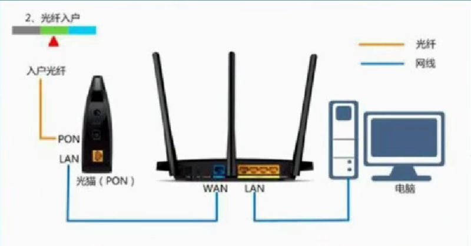
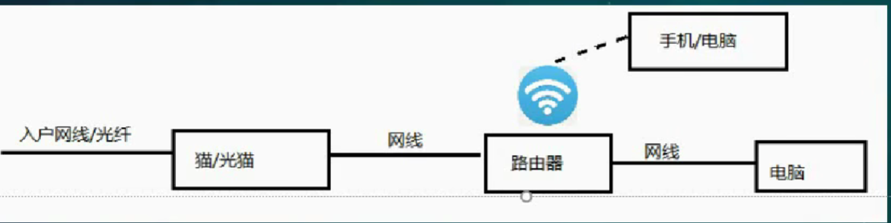

# 成年人应该懂的网络小知识
 

【猫】：光电信号转换器，将易于传输的光信号转换为电子设备能识别的电信号

【带宽】：百兆（100M）的单位是Mb，小写b是bit，下载速度是MB，大写的B是Byte，1Byte=8bit，所以百兆网最大下载速度就是12.5MB/s

【路由器】：解决了只有一台设备能上网/每次上网前需要拨号的问题。
 

Q：判断一下为什么路由器满格但还是断网了？
A：网线坏了（宠物咬断了），光猫坏了（摔坏了，电源松了），光纤坏了（施工挖断了，欠费了，运营商维护）

## 这是二级标题
今天学到了一个新的金融概念。

### 如何插入图片？
把你想要展示的图片（比如叫 test.jpg）放到 images 文件夹里。
然后在文章里这样写就能显示图片：
